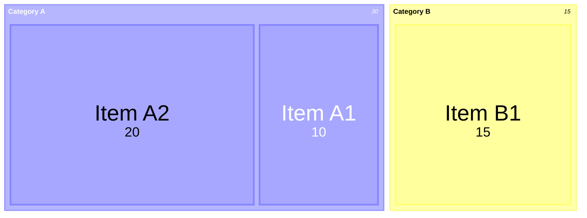
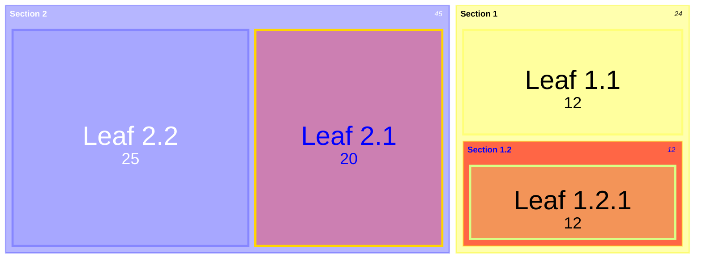
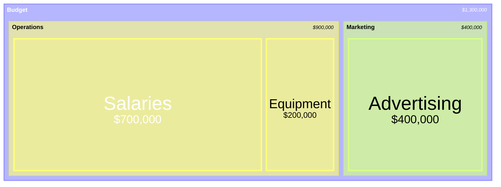

# Treemap Diagram

- **Keyword(s):** `treemap-beta`
- **Introduced:** mermaid 11.x — absent from the v10.9.6 diagram registry, so it needs a v11-era renderer — the doc gives no version, only "This is a new diagram type in Mermaid. Its syntax may evolve in future versions." **Beta** — keyword carries `-beta`; check your renderer's pinned version, GitHub in particular lags.
- **Use when:** showing hierarchical part-of-whole data where both nesting AND relative size matter (disk usage, org budget by department/line-item).
- **Avoid when:** you have no hierarchy — use `pie`; or you're showing flow between stages rather than containment — use `sankey`.

## Minimal example

## Core syntax

- Section/parent nodes: quoted text alone on a line, `"Section Name"`.
- Leaf nodes with a value: `"Leaf Name": value`.
- Hierarchy is indentation-based (spaces or tabs) — a node's children are the more-indented lines beneath it.
- Styling: append `:::className` to any node, then define it with `classDef className <css-props>;` at the end of the diagram (standard mermaid `classDef`/`class` mechanism).

## Config (frontmatter `config.treemap`)

| Option | Effect | Default |
|---|---|---|
| `useMaxWidth` | scale to 100% of container | `true` |
| `padding` | internal padding between nodes | `10` |
| `diagramPadding` | padding around the whole diagram | `8` |
| `showValues` | show/hide values on nodes | `true` |
| `nodeWidth` / `nodeHeight` | node sizing | `100` / `40` |
| `borderWidth` | node border width | `1` |
| `valueFontSize` / `labelFontSize` | text sizing | `12` / `14` |
| `valueFormat` | D3 format specifier for values, see below | `','` |

## Value formatting

`valueFormat` mostly follows [D3's format specifiers](https://github.com/d3/d3-format#locale_format), plus a few built-in currency shortcuts.

| Pattern | Example output |
|---|---|
| `,` (default) | thousands separator |
| `$` | dollar sign |
| `.1f` | one decimal place |
| `.1%` | percentage, one decimal |
| `$0,0` | `$1,234` style |
| `$,.2f` | dollar sign + thousands + 2 decimals |

## Gotchas

- Indentation is significant and whitespace-sensitive — mixing tabs and spaces, or inconsistent indent width, will misplace nodes in the hierarchy.
- A parent node's own value isn't set directly; parent size is implicitly the sum of its leaves. There's no documented syntax for giving a section its own value alongside children.
- Negative values aren't supported (per the doc's own limitations note) — don't feed it deltas or signed data.
- Beta keyword — expect syntax changes across mermaid releases; the doc explicitly says so.

## Deeper

See `../../assets/treemap-beta/examples.md` for realistic examples.
