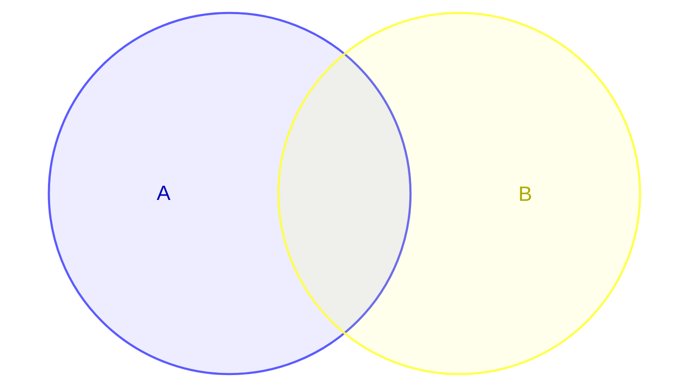
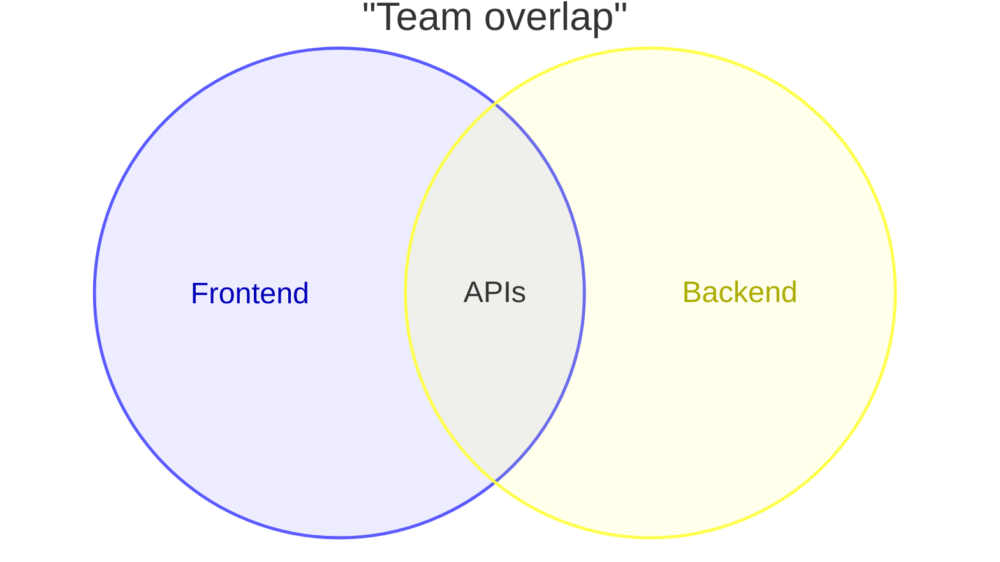
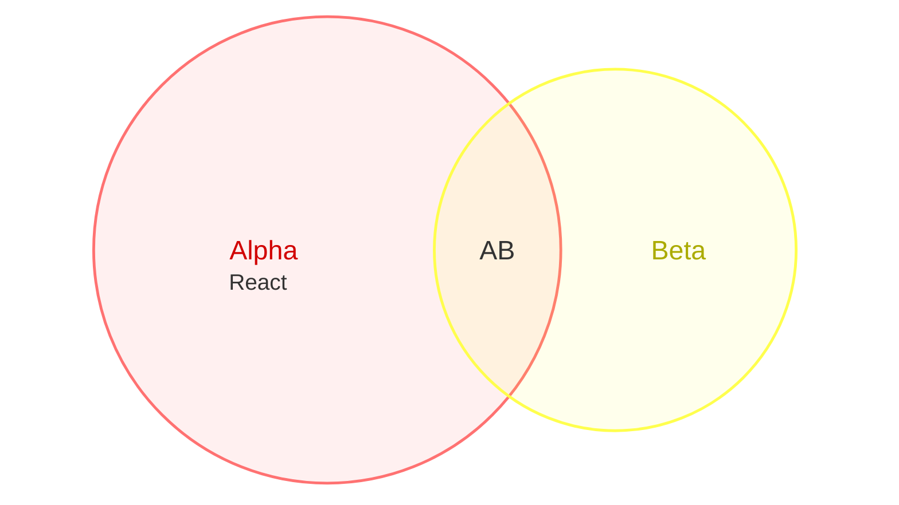

# Venn Diagram

- **Keyword(s):** `venn-beta`
- **Introduced:** mermaid v11.12.3. **Beta** — the doc explicitly warns this is a new diagram type and syntax may evolve.
- **Use when:** showing set overlap — which items/categories belong to more than one group, and how big each group or overlap is.
- **Avoid when:** you have more than 3–4 sets or need precise proportional area — Venn layouts get visually unreadable past a handful of sets; consider a table or UpSet-style plot instead (not a mermaid type).

## Minimal example

## Core syntax

| Construct | Meaning |
|---|---|
| `venn-beta` | required first line |
| `title "text"` | optional title |
| `set Name` | declares one circle; `Name` can be a bare word (`A`, `Set_1`) or quoted string |
| `union A,B[...]` | overlap region of two or more previously-declared sets; 3+ names are supported, mermaid renders the implied pairwise overlaps |
| `Name["Label"]` | bracket syntax to give a `set` or `union` a display label distinct from its identifier |
| `:N` suffix | sets the relative size of a set or union, e.g. `set A:20` |
| `text Id["Label"]` (indented) | places a label inside the most recently declared `set`/`union` |
| `style target prop:value` | apply `fill`, `color`, `stroke`, `stroke-width`, or `fill-opacity` to a set/union/text id |

Sizing and text:

## Gotchas

- `union` identifiers must reference sets already declared earlier with `set` — order matters, forward references aren't documented as supported.
- Higher-arity unions (3+ sets) render the pairwise overlaps automatically so a label has somewhere to sit — but the doc doesn't cover 4+ set unions explicitly; test before relying on it.
- `text` lines attach to whichever `set`/`union` immediately precedes them by indentation, not by explicit reference — reordering blocks can silently reattach text to the wrong shape.

## Deeper

See `../../assets/venn-beta/examples.md` for sized, labeled, and styled variants.
