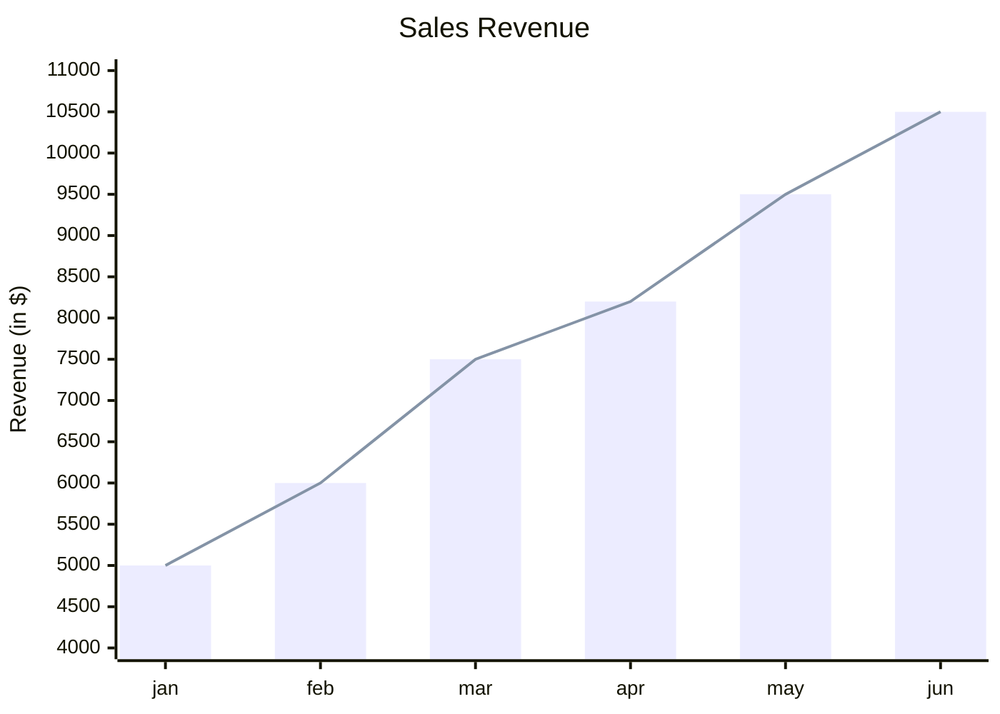
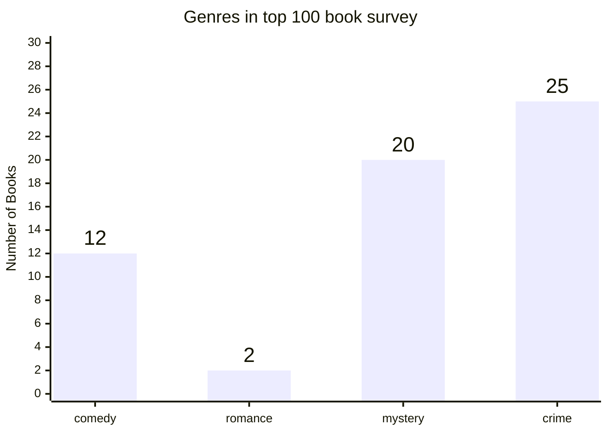
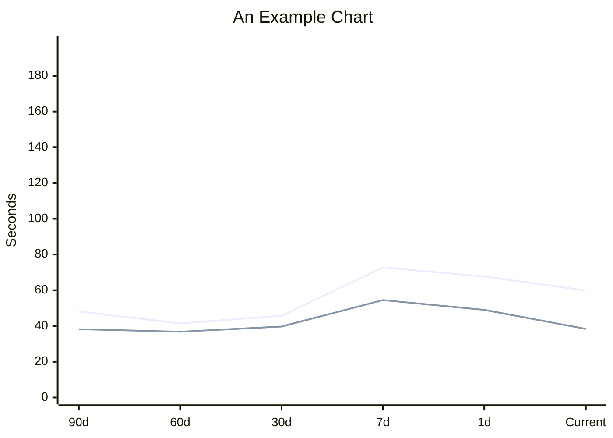

# XY Chart

- **Keyword(s):** `xychart`, `xychart-beta`
- **Introduced:** core — in mermaid since 10.9.6 or earlier (verified against the v10.9.6 diagram registry), so it renders on effectively any deployed mermaid — the doc gives no introduction version. The doc itself is inconsistent about beta status: most examples use plain `xychart`, but the "Legend" example uses `xychart-beta` — treat that spelling as effectively unstable/beta even though the feature it demonstrates is documented and stable. Bar and line data-label features are v11.14.0+; per-point line labels are v11.16.0+; the legend itself (shown automatically for named `bar`/`line` series) is v11.17.0+ — a renderer older than 11.17 (possibly GitHub — see the skill's version note) ignores series names and shows no legend, but does not reject the diagram.
- **Use when:** plotting numeric or categorical series on a real x/y axis — bar, line, or both together.
- **Avoid when:** you have no axis semantics (just proportions) — use `pie`; or a 2x2 bucket grid without a numeric scale — use `quadrantChart`.

## Minimal example



## Core syntax

- `xychart` or `xychart horizontal` (default orientation is vertical).
- `title "<text>"` — quote if it contains a space; single words don't need quotes.
- `x-axis`: either a numeric range (`x-axis title min --> max`) or categories (`x-axis "title" [cat1, "cat two", cat3]`). Optional — axis range auto-generates from data if omitted.
- `y-axis`: numeric only, `y-axis title min --> max` or just `y-axis title` (range auto-generated). Optional.
- `bar [v1, v2, ...]` and `line [v1, v2, ...]` plot series; prefix with a quoted name (`bar "series name" [...]`) to add it to the legend — unnamed series are omitted from the legend.
- Multiple `bar`/`line` statements layer on the same chart.
- Text values with spaces need double quotes; single-word values don't.

## Per-point line labels (v11.16.0+)

Append a quoted label after any numeric value in a `line` series; labels are optional per point (mix labeled and unlabeled freely). Rendered above the point (vertical orientation) or to the right (horizontal). Fixed 12px font. Not supported on `bar` — the syntax is accepted but labels are silently ignored there.

```mermaid
xychart
    title "Smallest AI models scoring above 60% on MMLU"
    x-axis "Date" ["Apr 2022", "Feb 2023", "Jul 2023", "Sep 2023", "Apr 2024"]
    y-axis "Parameters (B)" 0 --> 600
    line [540 "PaLM", 65 "LLaMA-65B", 34 "Llama 2 34B", 7 "Mistral 7B", 3.8 "Phi-3-mini"]
```

## Data labels on bars (v11.14.0+, config only)

`showDataLabel: true` (inside the bar) and `showDataLabelOutsideBar: true` (moves it outside) go in `config.xyChart`, not in the diagram body:



## Legend (v11.17.0+)

Naming a `bar` or `line` series (the quoted-string form above) now shows it in an automatic legend; unnamed series are omitted. No new syntax is required beyond naming the series:



`showLegend` (default `true`), `legendFontSize` (default `14`), and `legendPadding` (default `10`) go in `config.xyChart`, the same place as the data-label config above.

## Gotchas

- `y-axis` is numeric-only; you cannot give it categories — only `x-axis` supports categorical values.
- If you omit both axes, ranges are inferred from the data — fine for a quick sketch, risky if you need a stable axis across regenerated diagrams.
- Point labels only work on `line`, not `bar`; putting a label on a bar value is silently ignored rather than erroring.

## Deeper

See `../../assets/xychart/examples.md` for realistic examples.
