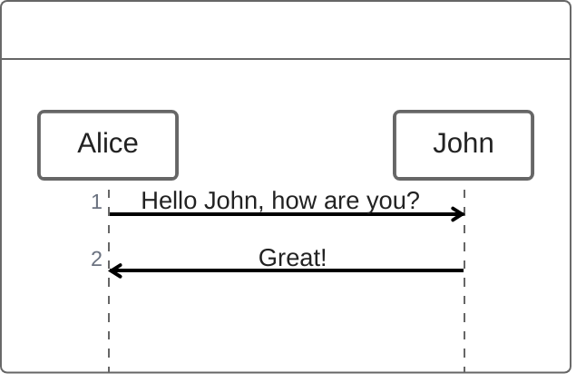
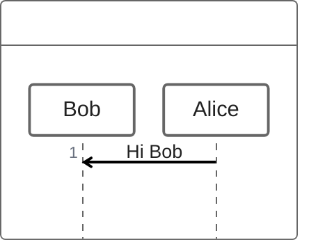
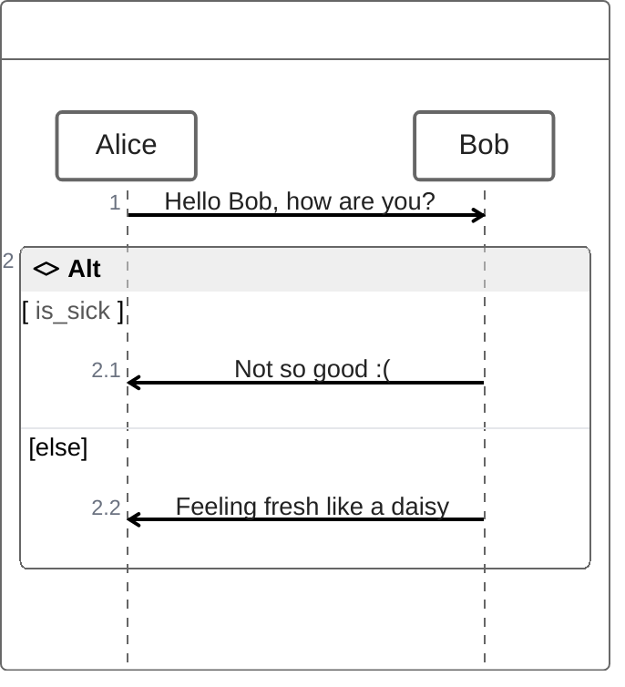

# ZenUML

- **Keyword(s):** `zenuml`
- **Introduced:** external diagram — not in mermaid's core registry at any version — the official doc states no version number and carries no `-beta` suffix, but explicitly calls its rendering "experimental lazy loading & async rendering features which could change in the future." Treat it as unstable regardless of the missing beta marker.
- **Use when:** you want a sequence diagram written in a code-like, nestable syntax (method calls, `if`/`while`/`try-catch` blocks) rather than mermaid's native arrow-per-line `sequenceDiagram` syntax.
- **Avoid when:** you need broad renderer support — **ZenUML requires a separate integration package** (`@mermaid-js/mermaid-zenuml`, loaded via `mermaid.registerExternalDiagrams`) in many embedding contexts, and the doc's own example targets a raw HTML page wiring this up manually, not a batteries-included renderer. If broad compatibility (docs sites, GitHub, static renderers) matters more than the nicer syntax, use plain `sequenceDiagram` instead.

## Minimal example

## Core syntax

**Participants** — implicit by order of first appearance, or declared explicitly to control ordering:

Use `@Actor Name` / `@Database Name` to render a participant with a role-specific symbol instead of a plain rectangle. Use `A as Alice` to give a participant a short identifier and a descriptive label at once.

**Messages:**

| Kind | Syntax |
|---|---|
| Async (fire-and-forget) | `Alice->Bob: message text` |
| Sync (blocking call) | `A.SyncMessage()` or `A.SyncMessage(args) { ...nested calls... }` |
| Creation | `new A1` / `new A2(args)` |
| Reply | `a = A.SyncMessage()`, or `return result` inside a `{}` block, or `@return` before an async message to reply from a nested level |

**Nesting and control flow** — sync/creation messages nest with `{}`; control constructs read like code:

| Construct | Syntax |
|---|---|
| Loop | `while(cond) { ... }`, `for(...) { ... }`, `forEach`/`foreach`, `loop { ... }` |
| Alternative paths | `if(cond) { ... } else if(cond) { ... } else { ... }` |
| Optional fragment | `opt { ... }` |
| Parallel | `par { statement1 statement2 }` |
| Exception handling | `try { ... } catch { ... } finally { ... }` |
| Comment | `// text` (renders above the next message; Markdown supported) |

## Gotchas

- **External integration required** in many renderers: the doc's own instructions show manually registering a separate ESM package (`mermaid-zenuml`) via `mermaid.registerExternalDiagrams` — a plain `<script src=mermaid>` include is not enough. If you don't control the renderer's load path (e.g. GitHub-rendered markdown), assume `zenuml` blocks render as nothing.
- The doc itself flags this diagram as using "experimental" lazy-loading/async rendering that "could change in the future" — don't treat the syntax as settled just because it lacks a `-beta` suffix.
- `@return` is rarely needed — only reach for it when you must reply from more than one nesting level up; a normal `return`/assignment reply covers the common case.
- Comments on a participant declaration line are silently dropped ("not rendered") — only comments directly above a message or fragment render.

## Deeper

See `../../assets/zenuml/examples.md` for reply-from-nested-level and try/catch/finally worked examples.
