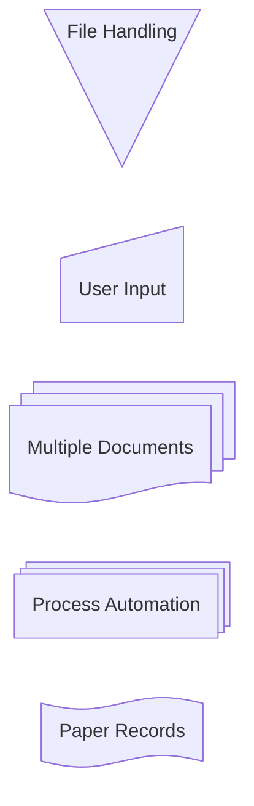

# Flowchart node shapes

## Classic shapes

| Shape | Syntax |
| --- | --- |
| Rectangle (default) | `id1[This is the text in the box]` |
| Round edges | `id1(This is the text in the box)` |
| Stadium | `id1([This is the text in the box])` |
| Subroutine | `id1[[This is the text in the box]]` |
| Cylinder / database | `id1[(Database)]` |
| Circle | `id1((This is the text in the circle))` |
| Asymmetric (flag) | `id1>This is the text in the box]` (mirror shape not currently available) |
| Rhombus / decision | `id1{This is the text in the box}` |
| Hexagon | `id1{{This is the text in the box}}` |
| Parallelogram | `id1[/This is the text in the box/]` |
| Parallelogram alt | `id1[\This is the text in the box\]` |
| Trapezoid | `A[/Christmas\]` |
| Trapezoid alt | `B[\Go shopping/]` |
| Double circle | `id1(((This is the text in the circle)))` |

## Expanded shape syntax (v11.3.0+)

New shapes use `id@{ shape: <name>, label: "text" }` instead of bracket syntax, e.g. `A@{ shape: rect, label: "This is a process" }`. `A@{ shape: rect }` renders the same as `A["A"]`.

| Short name | Semantic meaning |
| --- | --- |
| `rect` | Process |
| `rounded` | Event |
| `stadium` | Terminal point |
| `subproc` | Subprocess |
| `cyl` | Database |
| `circle` | Start |
| `odd` | Odd |
| `diamond` | Decision |
| `hex` | Prepare conditional |
| `lean-r` | Data input/output (lean right) |
| `lean-l` | Data input/output (lean left) |
| `datastore` | Datastore (top/bottom border) |
| `trap-b` | Priority action (trapezoid, base bottom) |
| `trap-t` | Manual operation (trapezoid, base top) |
| `dbl-circ` | Stop (double circle) |
| `text` | Text block |
| `notch-rect` | Card (notched rectangle) |
| `lin-rect` | Lined/shaded process |
| `sm-circ` | Start (small circle) |
| `framed-circle` | Stop (framed circle) |
| `fork` | Fork/join (long rectangle) |
| `hourglass` | Collate |
| `comment` | Comment (curly brace) |
| `brace-r` | Comment (curly brace, right) |
| `braces` | Comment (curly braces both sides) |
| `bolt` | Com link (lightning bolt) |
| `doc` | Document |
| `delay` | Delay (half-rounded rectangle) |
| `das` | Direct access storage (horizontal cylinder) |
| `lin-cyl` | Disk storage (lined cylinder) |
| `curv-trap` | Display (curved trapezoid) |
| `div-rect` | Divided process (divided rectangle) |
| `tri` | Extract (small triangle) |
| `win-pane` | Internal storage (window pane) |
| `f-circ` | Junction (filled circle) |
| `lin-doc` | Lined document |
| `notch-pent` | Loop limit (notched pentagon) |
| `flip-tri` | Manual file (flipped triangle) |
| `sl-rect` | Manual input (sloped rectangle) |
| `docs` | Multi-document (stacked document) |
| `processes` | Multi-process (stacked rectangle) |
| `flag` | Paper tape |
| `bow-rect` | Stored data (bow-tie rectangle) |
| `cross-circ` | Summary (crossed circle) |
| `tag-doc` | Tagged document |
| `tag-rect` | Tagged process (tagged rectangle) |



Note: `manual-file`, `manual-input`, and `procs` appear in the source doc's example only; the canonical short-name table above (`flip-tri`, `sl-rect`, `processes`) is the documented mapping - prefer the table names.

## Special shapes: icon and image (v11.3.0+)

Icon (requires registering an icon pack first):


Params: `icon` (registered pack name), `form` (`square`/`circle`/`rounded`, no background if omitted), `label`, `pos` (`t`/`b`, default bottom), `h` (height, min/default 48).

Image:

```mermaid
flowchart TD
    A@{ img: "https://example.com/image.png", label: "Image Label", pos: "t", w: 60, h: 60, constraint: "off" }
```

Params: `img` (URL), `label`, `pos` (`t`/`b`), `w`/`h` (default to natural size), `constraint` (`on`/`off` - `on` locks aspect ratio when resizing via `h`).
