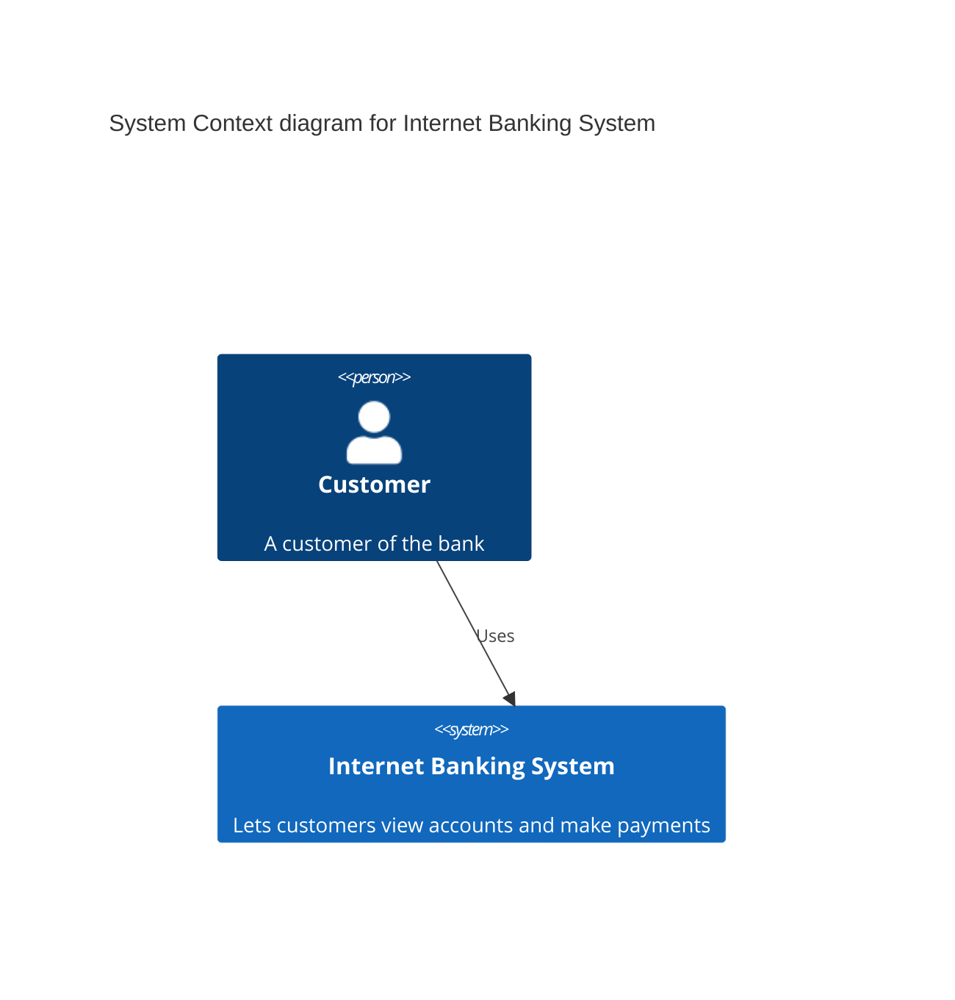

# C4

- **Keyword(s):** `C4Context`, `C4Container`, `C4Component`, `C4Dynamic`, `C4Deployment`
- **Introduced:** core — in mermaid since 10.9.6 or earlier (verified against the v10.9.6 diagram registry), so it renders on effectively any deployed mermaid — the official doc gives no version number. **Explicitly experimental**: "syntax and properties can change in future releases," per mermaid's own doc, and full documentation is still pending on the upstream side.
- **Use when:** you want the C4 model's four levels (context/container/component/deployment) and are already familiar with PlantUML's C4 macros — mermaid's syntax mirrors C4-PlantUML.
- **Avoid when:** you want a general infra topology without C4's strict person/system/container/component vocabulary — use `architecture` instead; it's newer, actively maintained, and not marked experimental.

## Minimal example

## Core syntax

Pick one of the five diagram types as your opening keyword — each renders a different C4 level:

| Keyword | C4 level |
|---|---|
| `C4Context` | System Context |
| `C4Container` | Container |
| `C4Component` | Component |
| `C4Dynamic` | Dynamic (numbered call sequence) |
| `C4Deployment` | Deployment |

Elements and boundaries nest with `{ ... }` blocks (`Enterprise_Boundary`, `System_Boundary`, `Container_Boundary`, `Deployment_Node`, `Boundary`). Relationships use `Rel(from, to, label, ?technology)` and its directional variants. Full element/relationship vocabulary: [shapes.md](../../assets/C4Context/shapes.md).

Layout is **not** force-directed — position follows statement order. `UpdateLayoutConfig($c4ShapeInRow="3", $c4BoundaryInRow="1")` controls how many shapes/boundaries wrap per row. Per-element/relationship visual tweaks go through `UpdateElementStyle(...)` and `UpdateRelStyle(...)` (the latter accepts `$offsetX`/`$offsetY` to nudge relationship label position).

## Gotchas

- This is mermaid's own words, not a guess: syntax "can change in future releases" — pin your mermaid version if you depend on a specific C4 rendering.
- `Lay_U`/`Lay_D`/`Lay_L`/`Lay_R` layout directives from C4-PlantUML are **not supported** and have no mermaid equivalent — the only layout control is statement order plus `UpdateLayoutConfig`.
- Sprites, tags/stereotypes (`AddElementTag`, `AddRelTag`), legends, and `link` are listed as unsupported/unfinished in the doc — don't reach for them.
- CSS/color styling is otherwise fixed per C4 element type; you can't theme it the way you theme other diagram types.
- `RelIndex` is accepted for C4-PlantUML compatibility but its index argument is ignored — sequence numbers come from statement order, not the index you pass.

## Deeper

- [shapes.md](../../assets/C4Context/shapes.md) — Person/System/Container/Boundary element and relationship reference
- [examples.md](../../assets/C4Context/examples.md) — context, container, component, and deployment examples
