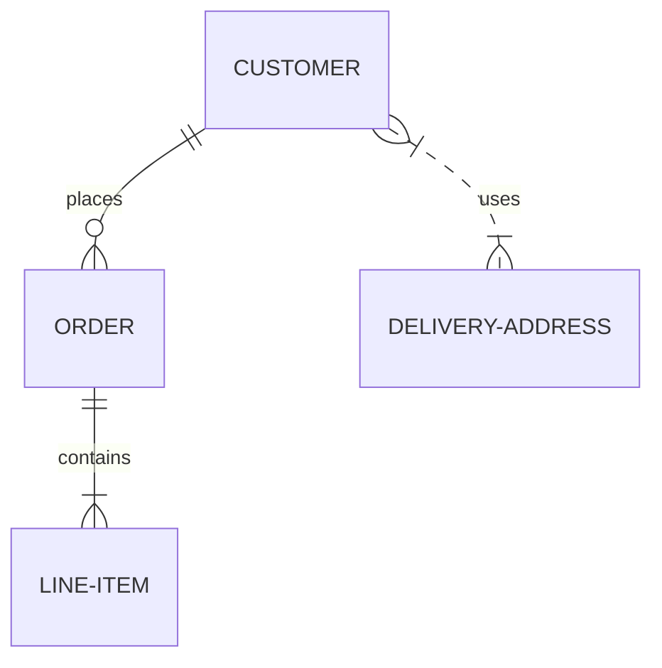
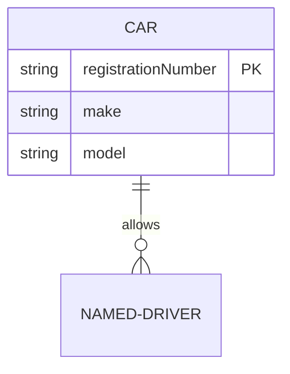

# Entity Relationship Diagram

- **Keyword(s):** `erDiagram`
- **Introduced:** core — in mermaid since 10.9.6 or earlier (verified against the v10.9.6 diagram registry), so it renders on effectively any deployed mermaid (source doc doesn't state it). Per-feature versions: optional/nullable attribute types (`type?`) v11.16.0+; subgraphs (version placeholder unresolved in source doc at fetch time).
- **Use when:** you need to model data entities and the cardinality of relationships between them (logical or physical DB schema).
- **Avoid when:** you need to show object behavior/methods - use `classDiagram`; or a process flow - use `flowchart`.

## Minimal example



## Core syntax

```text
<first-entity> [<relationship> <second-entity> : <relationship-label>]
```

Only `first-entity` is mandatory - useful for declaring an entity with no relationships yet. If you specify any other part, all parts become mandatory (relationship, second entity, and label).

Cardinality and identifying-vs-non-identifying line style are enumerated in `../../assets/erDiagram/shapes.md`.

Attributes: a block of `type name` pairs inside `{}` under an entity:



`type` must start with a letter (digits, hyphens, underscores, brackets ok after). Append `?` to a type for optional/nullable (v11.16.0+). `name` follows similar rules. Keys go after the name: `PK`, `FK`, `UK`, or comma-combined (`PK, FK`). A trailing double-quoted string is a comment (no embedded double quotes allowed).

Entity alias: `p[Person] { string firstName }` shows "Person" instead of the internal id `p`.

Direction: `direction LR` (also `TB`, `BT`, `RL`).

Subgraphs group entities: `subgraph title ... end`; multi-word titles need quotes and are referenced by id, not title text, when used in a relationship.

Comments: none documented for this diagram type in the source doc - omit rather than guess.

## Gotchas

- Entity names are conventionally singular nouns (`CUSTOMER`, not `CUSTOMERS`) - not enforced, but expected by readers familiar with ER modeling.
- Deciding whether to model foreign keys as attributes is a modeling choice, not a Mermaid requirement - the relationship line already conveys the association.
- A relationship-labelled statement (with cardinality on both sides) requires *all* parts - you can't specify a relationship without also specifying its label.
- Comments in attribute definitions can't contain a double-quote character.
- A subgraph id containing spaces must be quoted when referenced from a relationship elsewhere in the diagram.

## Deeper

See `../../assets/erDiagram/shapes.md` for the cardinality and key-marker vocabulary and `../../assets/erDiagram/examples.md` for worked examples.
