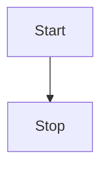
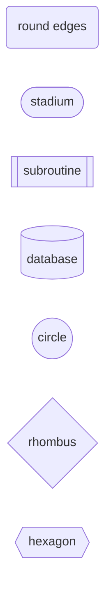
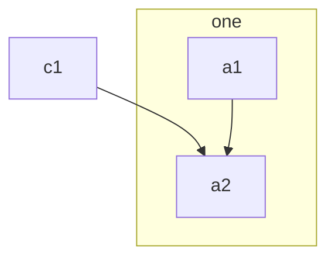

# Flowchart

- **Keyword(s):** `flowchart` (aliases: `graph`)
- **Introduced:** core — in mermaid since 10.9.6 or earlier (verified against the v10.9.6 diagram registry), so it renders on effectively any deployed mermaid (source doc doesn't state it). Per-feature versions: expanded shape vocabulary (`@{ shape: ... }`) and icon/image shapes v11.3.0+, FontAwesome icon-pack registration v11.7.0+, edge-level curve style via edge IDs v11.10.0+, collapsible subgraphs (version placeholder unresolved in source doc at fetch time).
- **Use when:** you need to show a process, decision tree, or dependency graph as nodes and directed/undirected edges.
- **Avoid when:** you need time-ordered messages between actors - use `sequenceDiagram` instead.

## Minimal example

## Core syntax

Direction: `TB`/`TD` (top-down), `BT` (bottom-up), `LR` (left-right), `RL` (right-left).

Classic node shapes (id plus bracket style sets the shape - see `../../assets/flowchart/shapes.md` for the full list including the v11.3.0+ `@{ shape: ... }` vocabulary):

Links:

| Style             | Syntax  |
| ----------------- | ------- |
| Arrow              | `A-->B` |
| Open (no arrow)    | `A---B` |
| Text on link        | `A-->|text|B` or `A-- text -->B` |
| Dotted             | `A-.->B` |
| Thick               | `A==>B` |
| Invisible (layout only) | `A~~~B` |
| Circle edge          | `A--oB` |
| Cross edge            | `A--xB` |
| Multidirectional      | `A o--o B`, `B <--> C`, `C x--x D` |

Chaining: `A -- text --> B -- text2 --> C` and fan-out/fan-in with `&`: `A & B --> C & D`.

Minimum link length (forces extra ranks): add extra dashes/dots/equals, e.g. `A ---->|No| E` spans two more ranks than `A -->|No| E`.

Subgraphs:

Give a subgraph an explicit id with `subgraph ide1 [one]`. A `direction` statement inside a subgraph sets its own layout direction, but is ignored if any of the subgraph's nodes link outside it (the subgraph then inherits the parent's direction).

Styling: `style id1 fill:#f9f,stroke:#333`; reusable via `classDef name fill:#f9f,...` then `class id1 name` or the shorthand `id1:::name`.

Comments: `%% comment text` on its own line.

## Gotchas

- A node label of exactly `end` (any-case-insensitive lowercase) breaks the parser - capitalize at least one letter (`End`, `END`) or quote it.
- A node id starting with `o` or `x` right before `---` reads as a circle/cross edge (`A---oB`); add a space or capitalize to avoid it.
- Special characters in labels need double quotes: `id1["This is the (text) in the box"]`. Unicode also needs quotes: `id["This ❤ Unicode"]`.
- Escape characters via decimal entity codes, e.g. `#quot;` or `#35;` for `#` itself.
- Markdown-formatted labels (bold/italic/auto-wrap) need double-quote + backtick syntax: `` id1["`**bold** and _italic_`"] `` - this is a different feature from the plain quoted-unicode form above.
- `linkStyle N ...` targets links by their 0-based definition order, not by id, unless you've assigned the link an id with `e1@-->` first.
- Hex colors and CSS `stroke-dasharray` commas inside a `classDef` must be escaped as `\,` since commas are the classDef delimiter.
- External CSS targeting `.class > rect` does not reliably override Mermaid's injected styles (they carry `!important` and SVG-id scoping) - use `classDef`/`class` instead.

## Deeper

See `../../assets/flowchart/shapes.md` for the full node-shape vocabulary and `../../assets/flowchart/examples.md` for worked examples.
