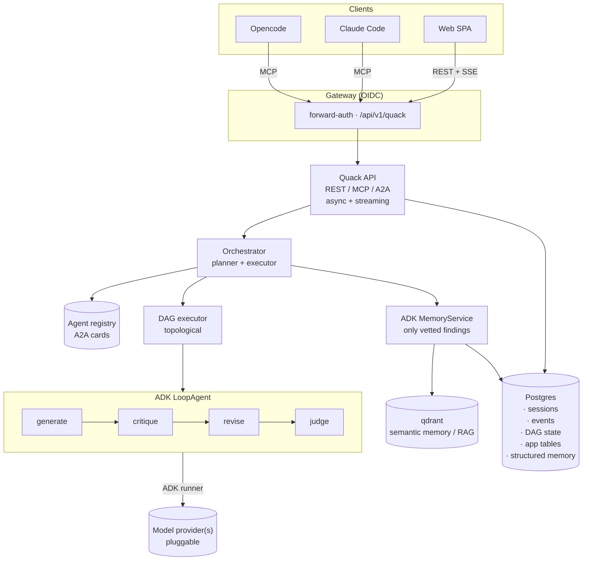
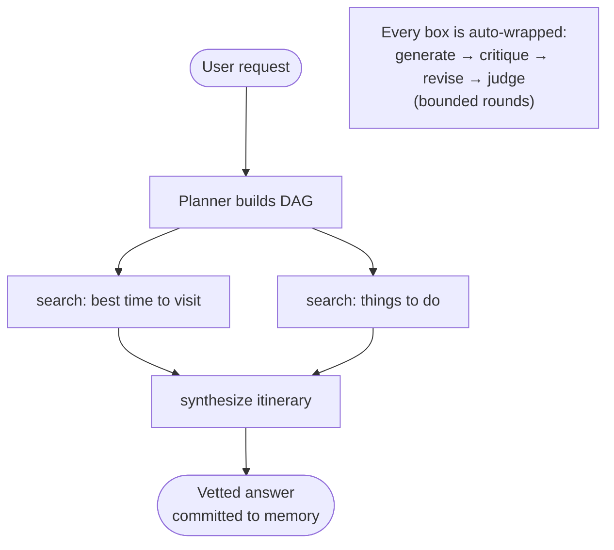

# Quack

**Quack** is my own **local LLM helper** — able to handle day-to-day tasks without my
constant involvement or hand-holding. The name fits the design: it's the rubber duck that
*talks back* (it answers), and whose agents *talk back to each other* (adversarial vetting)
before any answer is trusted.

Because the models and resources available to complete those tasks are limited, **no output
can be trusted by default**. The output of one agent must therefore be vetted by a
[separate, adversarial agent][adv]. This is accomplished through an [agent orchestrator][orch]
that takes a user request and decomposes it into a **Directed Acyclic Graph (DAG)** of the
agents needed to complete the task.

Example requests:

- "Research the best time to go to Dublin, and what I can do there."
- "Research the latest developments in local LLM models and harnesses — what works for my
  hardware, and what should I try out?"

## Goals

1. **Tasking.** A frontend (Opencode, Claude Code, SPAs) can hand the orchestrator a
   natural-language request.
2. **Decomposition.** The orchestrator breaks the request down and builds a **DAG** of the
   agents needed to complete the task.
3. **Dispatch + adversarial quality.** The orchestrator dispatches work across those agents
   and uses [adversarial agents][adv] — critics, red-teamers, and verifiers running a
   generate → critique → revise → judge loop — to guard against confident-but-wrong output
   and ensure high-quality results.
4. **Synthesis.** The orchestrator returns a high-quality, well-reasoned answer to the user.
5. **Memory.** Quack writes durable memories — vetted findings, user preferences, and prior
   results — and recalls them on future requests, so it learns over time, personalizes, and
   avoids redoing work. Only adversarially-vetted output is committed to memory. (Backed by
   ADK's `MemoryService`: `AddSessionToMemory` to write, `SearchMemory` to recall.)

## Implementation

Quack is a Go monorepo built on **[Google ADK for Go][adk]**. Clients hand it a request through a
gateway, and from there the **orchestrator** plans a DAG of agents. A small **custom executor**
runs each node as an ADK agent, wrapping every one in an adversarial generate→critique→revise→judge
loop. It all sits on pluggable model providers and data stores. Runs happen in the background,
stream their progress, and survive a restart.



### AI Inferencing

Every agent gets a `model.LLM` built by a **model factory** in the `platform` module from its
config, which owns retries, timeouts, and token budgeting. The factory is **provider-pluggable**:
ADK's `model.LLM` is the abstraction, so any provider with an adapter can back an agent (the
`openai` provider kind, via the [`adk-go-openai`][adkopenai] adapter, is the default). Endpoints,
providers, and per-agent model choices live in [docs/configuration.md](docs/configuration.md).

- **Per-agent model and provider, configurable.** Every agent (worker, critic, judge, planner)
  names its model and provider in config, falling back to a shared default. So the planner might
  run a larger model and the workers a faster one (e.g. `gpt-oss-120b` vs `qwen3.6-35b`), on the
  same or different providers.
- **Independence by configuration.** The judge is an *independently-configured* model (a
  different model, optionally a different provider or host). That is what gives the
  genuinely-different-weights independence the trust gate relies on. See **Adversarial vetting**
  below.
- **Concurrency follows the provider.** The executor topologically orders the DAG and runs nodes
  as concurrently as the providers allow. A single-model local backend forces sequential
  execution; a hosted API or multiple providers allow parallel branches.
- **Context budgeting.** Before a node's output flows downstream, `platform` trims or
  summarizes it, so the final synthesis stays inside the model's context window.

### Adversarial vetting

Limited local models bluff, so nothing a node produces is trusted by default. Every node's
output passes a **trust gate** before it counts:

1. **Self-refine (free).** The worker critiques and revises its own output in one pass
   ([Self-Refine][self-refine]). Cheap, but it shares the worker's blind spots, so it's a polish
   pass, not the trust decision.
2. **Independent judge.** A separate, independently-configured judge model (e.g.
   [`gemma4-26b-a4b`][selenemini]) scores the output. Because it is genuinely different weights from
   the worker, it catches blind spots the worker cannot see in its own output. This is the real
   trust decision ([the case for adversarial agents][adv]).

**The rubric is a per-node acceptance spec.** The judge needs concrete criteria; a vague rubric
makes a small judge wander. So the **planner writes the acceptance criteria for each
node when it builds the DAG** (it already defines the task, and "done" is the other half), layered
over a fixed constitution it cannot remove:

- **Standing criteria** (config, always applied): claims grounded in sources, no fabrication /
  admit unknowns. The "nothing trusted by default" invariants.
- **Per-node criteria** (planner-written, concrete, g-eval style): the specific bar for this
  subtask, e.g. "states specific months, not just summer", "gives a temperature range with units".

So each planned node carries its judge rubric beside its task. Independence still holds, since the
planner writes the rubric, a different model does the work, and a third scores it.

```yaml
node:
  task: "Find the best months to visit Dublin with typical temperatures."
  rubric:
    - "States specific months, not just 'summer'"
    - "Gives a temperature range with units"
    - "Every weather claim is attributed to a retrieved source"
```

**How it maps to ADK.** This is the canonical ADK [LoopAgent critic-refiner pattern][adk-loop],
so we barely build it. A node is a `loopagent.LoopAgent` whose sub-agents are the generator (on
the worker's model) and the judge (on its own model), bounded by `MaxIterations` (our
`max_rounds`). The judge ends the loop by calling the exit-loop tool (which sets
`actions.escalate`) once the output passes; results flow between sub-agents via `output_key`
session state. Per-agent models are just different `model.LLM`s.

**Lineage.** The patterns this leans on: [Self-Refine][self-refine] (the self-refine pass),
[LLM-as-a-Judge][llm-judge] (rubric scoring with concrete, decomposed criteria), and [adversarial
agents][adv] (why independence beats self-checking). [Reflexion][reflexion] (language reflections
stored in memory) and [CRITIC][critic] (tool-grounded critique) are noted for later.

**Out of scope for now:** escalation to the 70B `selene` judge for high-stakes nodes, and
tool-grounded critique.

### Orchestrator

The orchestrator is a **pure planner and executor**. It holds no domain tools of its own.

**Lifecycle of a request:**

1. **Plan (dynamic, plan-then-execute).** A planner LLM call turns the request into a DAG:
   nodes are agent invocations chosen from the **discovered agent-card registry**; edges are
   explicit data dependencies (a node's named outputs feed its dependents' inputs).
2. **Execute.** A custom **topological executor** walks the DAG. It runs nodes in dependency
   order (sequentially, per the inference constraint), passing outputs along edges.
3. **Vet (auto-wrapped nodes).** Every node is wrapped in an adversarial loop, an ADK
   `LoopAgent` that runs **generate → critique → revise → judge** for a bounded number of
   rounds. The loop lives *inside* the node, never as a cycle in the graph, so the DAG stays
   acyclic.
4. **Budget + stop.** **Confidence gating** (the judge must pass, or N rounds elapse) decides
   "good enough"; **hard caps** (max nodes / depth / tokens / wall-clock) are a backstop.
5. **Synthesize.** A final node composes the vetted node outputs into the answer.

**Resumability.** The plan, per-node status, and node outputs are persisted, so an interrupted
run resumes mid-graph after a crash/restart. **Failure handling:** a node that fails its
adversarial loop after max rounds is retried, then aborts the branch / escalates to the user
with what was learned.



#### APIs

Quack exposes three protocol faces over the same orchestrator, under `/api/v1/quack`:

- **REST** for the SPA and general clients (chat CRUD plus the task lifecycle).
- **[MCP][mcp] server** for Opencode and Claude Code.
- **[A2A][a2a] server** for the agent ecosystem. Agents publish real A2A **AgentCards**
  (in-process for now, ready to promote to standalone services later).

**Streaming is unified on Streamable HTTP.** REST and MCP share one transport: a request returns
either a JSON result or a `text/event-stream` of the shared event vocabulary (`token · thinking ·
tool_call · tool_result · confirmation_request · error · done`), resumable via session id +
`Last-Event-ID`. A2A carries the same events over its task lifecycle. A quick request streams its
response directly; a long-running run returns a **task id** the client (re)attaches to. Sketch:

```text
POST   /api/v1/quack/messages          → text/event-stream    (quick run: stream directly)
POST   /api/v1/quack/tasks             → { task_id }          (long run: detached)
GET    /api/v1/quack/tasks/{id}        → status + result
GET    /api/v1/quack/tasks/{id}/stream → text/event-stream    (reattach, resumable)
POST   /api/v1/quack/tasks/{id}/cancel
GET    /api/v1/quack/openapi.yaml      → public spec (no auth)
```

**Docs.** Quack serves its OpenAPI spec at `/api/v1/quack/openapi.yaml` (public, the schema-first
source of truth). It does not render its own docs UI; a deployment points an external Swagger UI at
that spec. (How the spec is registered with the gateway's docs site is in
[docs/configuration.md](docs/configuration.md).)

**Auth.** Quack authenticates **inbound** requests via **OIDC**, with the IdP pluggable in config
(`auth`). API, MCP, and A2A clients send a **bearer token** that Quack verifies against the
configured issuer and JWKS. Behind a trusted gateway (forward-auth), browser/SPA identity instead
arrives as the configured `trusted_headers`, so Quack doesn't re-run the login flow. Either way the
caller's identity (user, groups) is available for authorization. The IdP settings and gateway
deployment are in [docs/configuration.md](docs/configuration.md). (Outbound auth, for tools calling
external services, is out of scope for now.)

#### Tools

The orchestrator should be light on tools. It really only needs:

| Tool | Custom? | Description |
| --- | --- | --- |
| `plan_dag` | Yes | A [function tool][functiontool] that turns the request into a DAG. |
| [`agenttool`][agenttool] | No (ADK) | ADK's `AgentTool`, one per discovered agent, to hand a node off to a specialist. |
| [`loadmemorytool`][loadmemorytool] | No (ADK) | The model calls it on demand to recall memory (`MemoryService.SearchMemory`). |
| [`preloadmemorytool`][preloadmemorytool] | No (ADK) | Auto-injects relevant memory into the prompt at the start of each turn. |
| `write_memory` | Yes | A thin wrapper over ADK's [`AddSessionToMemory`][adkmemory]; commits only vetted findings. |

#### Data stores

Stores sit **behind ports**, so a backend can be swapped or added. Quack needs two roles:

| Role | Holds | Default backend |
| --- | --- | --- |
| **Relational store** | ADK sessions and events (`session/database`), the **DAG plan + per-node state** for resumability, app tables (task records, chat metadata, `contexts`), and **structured memory** (preferences, durable records). | Postgres |
| **Vector store** | **Semantic memory + RAG** vectors. | [qdrant][qdrant] |

**Memory** is ADK's `MemoryService` backed by the vector store (semantic) + the relational store
(structured); per Goal 5, **only adversarially-vetted findings are committed**. Default backends
and connections are in [docs/configuration.md](docs/configuration.md).

#### Configuration

Everything structural is **declarative YAML**; secrets (DSNs, tokens, API keys) come from env.
**Providers and stores are pluggable by `kind`** — the shape allows backends beyond the defaults
in theory, even though the initial implementation ships only the defaults (the `openai`
provider, Postgres, qdrant). Inference is declared **per agent** (each names a `provider` and a
`model`). Specialist agents aren't defined inline either: the config references external
[A2A **AgentCard**][agentcard] files (JSON, baked into the image for now), so they already meet
the real agent-card spec and can move to `/.well-known/agent-card.json` once promoted to
standalone A2A services.

The shape, illustratively:

```yaml
# illustrative; the actual values + justifications live in docs/configuration.md

providers:                       # pluggable; `kind` selects the adapter
  local:
    kind: openai                 # API protocol; e.g. openai | gemini | anthropic
    endpoint: ${LLM_BASE_URL}
    api_key: ${LLM_API_KEY}

orchestrator:
  planner:
    inference:
      provider: local
      model: gpt-oss-120b

adversarial:
  self_refine: true
  judge:
    inference:
      provider: local
      model: gemma4-26b-a4b         # independent judge
    threshold: 0.7
  max_rounds: 2

tools:                           # registry: catalog of available tools (agents select by name)
  web_search:
    kind: builtin                # e.g. builtin | mcp | http
  fetch:
    kind: builtin
  summarize:
    kind: builtin

agents:
  - card: ./cards/web-researcher.json   # external A2A AgentCard
    inference:
      provider: local
      model: qwen3.6-35b
    tools:                              # explicit; independent of the card's skills
      - web_search
      - fetch
      - summarize
  - card: ./cards/translator.json       # skill is pure model + prompt
    inference:
      provider: local
      model: qwen3.6-35b
    # no tools

budget:
  max_nodes: 12
  max_depth: 4
  max_tokens: 400000
  max_wall_clock: 10m

auth:                            # INBOUND; OIDC, plug in any IdP (Authentik, Keycloak, …)
  oidc:
    issuer: ${OIDC_ISSUER}
    audience: ${OIDC_AUDIENCE}
    jwks_url: ${OIDC_JWKS_URL}
  trusted_headers:               # identity injected by a trusted gateway (forward-auth)
    user: X-authentik-username
    groups: X-authentik-groups

stores:                          # by role; `kind` selects the backend
  relational:
    kind: postgres               # e.g. postgres | sqlite
    url: ${DATABASE_URL}
  vector:
    kind: qdrant                 # e.g. qdrant | pgvector
    url: ${QDRANT_URL}
```

The actual model assignments, thresholds, budgets, and env vars (with justifications) live in
[docs/configuration.md](docs/configuration.md), kept separate so they can change without
touching this document.

### Agents

An agent is a declarative specialist: an A2A **card** (what it does) plus a **system prompt** (how
it does it), bound to a model and a set of tools. There is **no code** to define one. The
orchestrator discovers agents by their cards and dispatches nodes to them; each node runs inside the
adversarial loop like any other.

#### APIs

Unlike the orchestrator's three faces, an agent speaks **A2A only**. It publishes an
[AgentCard][agentcard] and is invoked over [A2A][a2a]: in-process via the registry today, promotable
to a standalone A2A service later with no change to its definition. REST and MCP stay on the
orchestrator (the user-facing front door); A2A is the agent-to-agent protocol.

#### Tools

An agent's **`skills`** (its card) are capability-level and planner-facing: they are what the
orchestrator routes on, and they are **decoupled from tools**. A capability can come from the
agent's **model** (e.g. translate, reason), its **prompt** (e.g. act as a strict reviewer), or its
**tools** (e.g. search the web), so a skill may need many tools, one, or none. The only invariant is
honesty: the agent *as a whole* (model + prompt + tools) must actually be able to deliver every skill
it advertises. This keeps planning fully implementation-independent.

Tools are one capability source. They are pulled **by name from a shared registry** of pre-built and
custom tools; the registry uses the same `kind` shape as everything else (`builtin` now; `mcp` /
`http` reserved), and each tool carries its own config. Side-effecting tools are flagged to route
through the `confirmation_request` human-in-the-loop gate.

#### Data stores

Agents do **not** own stores. In-process, an agent runs inside the **orchestrator's ADK session** and
exchanges data through shared session state (`output_key` out, `{key}` in), which is how a node's
result flows along DAG edges. Long-term memory is reached through the memory tools, backed by the
same stores. (When an agent is promoted to a standalone A2A service it gets its own session, and the
A2A `ContextID` maps back to the orchestrator's session for continuity.)

#### Configuration

Each agent is a small bundle: **`agent-card.json`** (the A2A AgentCard: identity, skills, version)
and **`prompt.md`** (the system prompt). The Quack config binds the model (per-agent `inference`) and
an explicit tool selection (which may be empty) to the bundle. Adding or editing an agent is editing
these files, not recompiling.

```text
agents/
  web-researcher/
    agent-card.json     # A2A card: identity + skills
    prompt.md           # system prompt (behavior)
```

[adv]: https://jatinmishra27.medium.com/when-your-ai-needs-an-enemy-the-case-for-adversarial-agents-30a906b2273b
[orch]: https://www.ibm.com/think/topics/ai-agent-orchestration
[adk]: https://github.com/google/adk-go
[adkopenai]: https://github.com/byebyebruce/adk-go-openai
[qdrant]: https://github.com/qdrant/qdrant
[a2a]: https://a2a-protocol.org
[agentcard]: https://a2a-protocol.org/latest/specification/
[mcp]: https://modelcontextprotocol.io
[selenemini]: https://huggingface.co/mradermacher/Selene-1-Mini-Llama-3.1-8B-GGUF
[adk-loop]: https://google.github.io/adk-docs/agents/workflow-agents/loop-agents/
[self-refine]: https://arxiv.org/abs/2303.17651
[reflexion]: https://arxiv.org/abs/2303.11366
[llm-judge]: https://arxiv.org/abs/2306.05685
[critic]: https://arxiv.org/abs/2305.11738
[functiontool]: https://pkg.go.dev/google.golang.org/adk/tool/functiontool
[agenttool]: https://pkg.go.dev/google.golang.org/adk/tool/agenttool
[loadmemorytool]: https://pkg.go.dev/google.golang.org/adk/tool/loadmemorytool
[preloadmemorytool]: https://pkg.go.dev/google.golang.org/adk/tool/preloadmemorytool
[adkmemory]: https://pkg.go.dev/google.golang.org/adk/memory

<!-- Sections below are added one at a time as we agree on them. -->
