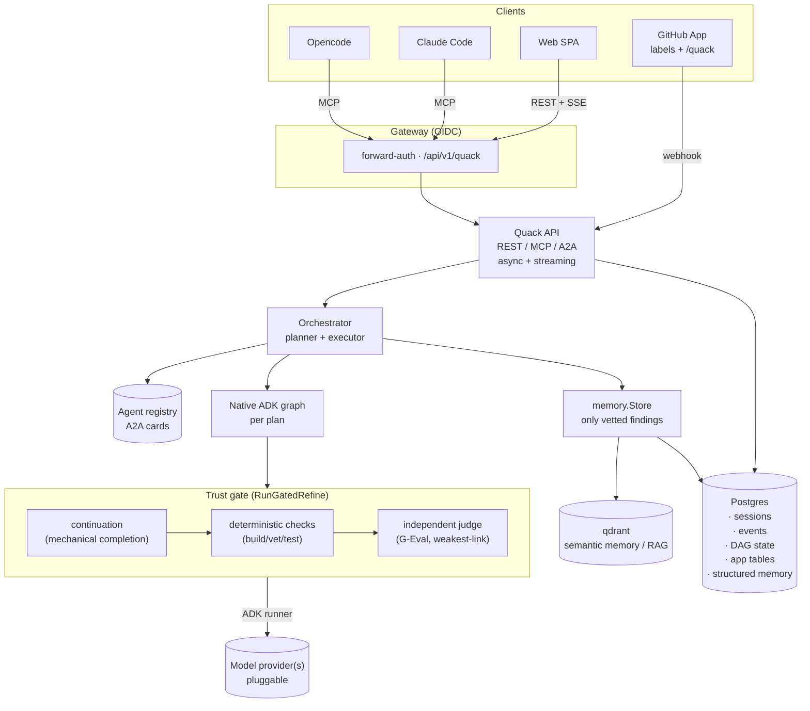

# Quack

**Quack** is my own **local LLM helper** - able to handle day-to-day tasks without my constant involvement or hand-holding.
The name fits the design: it's the rubber duck that *talks back* (it answers), and whose agents *talk back to each other* (adversarial vetting) before any answer is trusted.

## Philosophy

Quack's bet: a handful of **minimally-scoped agents**, each narrow enough to reason about, **adversarially vetted** against each other, beats trusting one big model to get it right on the first try. A request is decomposed into a DAG of small, single-purpose agents; every agent's output has to survive an independent judge - genuinely different weights, scoring against concrete, per-task criteria - before it counts.
The goal is a system that's greater than the sum of its (deliberately small) parts.

My motivation for building it this way: getting more real use out of smaller open-source models running locally, where no single model can be trusted by default.
That constraint shaped the design, but it doesn't require open or local models. An API-backed model slots into the same provider config as anything self-hosted, worker or judge alike.

## Quickstart

```bash
make build      # compiles the frontend, embeds it, builds ./quack
./quack init
```

`quack init` asks a short sequence of questions, in order:

1. **How will you use quack?** → *Local - run quack on this machine* (Remote just registers someone else's server and skips everything below).
2. **LLM provider** → an OpenAI-compatible endpoint + API key (a local llama-swap/Ollama/vLLM server, or a hosted API).
3. **Model roles**, each pre-filled with a detected default and (except main) a "None - disable" option:
   - **Main** - the model quack reasons and plans with.
   - **Judge** - the trust gate; None disables adversarial vetting entirely.
   - **Embedding** - semantic memory; None disables memory.
   - **Vision** / **Audio** - the image-reader / media-reader agents.
4. **Optional features** (multi-select) - web search, web fetch, coding agents.
   - Picking "Coding agents" adds two more questions: a coder model and the workspace sandbox mode (`bwrap` or `none`).
5. **Stores** - session storage (sqlite by default), plus a memory store if you set an embedding model, and search/fetch backends for whichever features you picked. Defaults are sane; enter accepts them.
6. **Review** - a summary of every answer above, then confirm to write `quack.yaml`.

```bash
./quack -p "Research the best time to visit Dublin" # one-shot prompt, print and exit
```

`-p` is the fastest way in: it prints the answer and exits with a pipeable status (`0` answered, `1` failed, `2` paused on a question). For anything longer-running, `quack chat new` starts a session, `quack chat send <id> "<msg>"` talks to it, and `quack chat show <id> -f` follows a run live. Full command reference: [`docs/cli.md`](docs/cli.md).

This is the "fully local, no containers" shape (sqlite, no qdrant). For the Docker-stack and always-on remote-server shapes, see [`docs/configuration/deployment.md`](docs/configuration/deployment.md). For dev setup (frontend dev server, running the test suite) see [CONTRIBUTING.md](CONTRIBUTING.md).

## Architecture

Quack is a Go monorepo built on **[Google ADK for Go][adk]**.
Clients hand it a request through a gateway, and from there the **orchestrator** plans a DAG of agents that runs as one native ADK graph, every node wrapped in quack's own **trust gate** before its output counts. It all sits on pluggable model providers and data stores. Runs happen in the background, stream their progress, and survive a restart.


```mermaid
flowchart TB
  subgraph Clients
    OC["Opencode"]
    CC["Claude Code"]
    SPA["Web SPA"]
    GH["GitHub App<br/>labels + /quack"]
  end

  subgraph GW["Gateway (OIDC)"]
    FA["forward-auth · /api/v1/quack"]
  end

  OC -->|MCP| FA
  CC -->|MCP| FA
  SPA -->|REST + SSE| FA
  GH -->|webhook| API

  FA --> API["Quack API<br/>REST / MCP / A2A<br/>async + streaming"]
  API --> ORCH["Orchestrator<br/>planner + executor"]
  ORCH --> REG[("Agent registry<br/>A2A cards")]
  ORCH --> EX["Native ADK graph<br/>per plan"]
  EX --> NODE

  subgraph NODE["Trust gate (RunGatedRefine)"]
    CONT["continuation<br/>(mechanical completion)"] --> CHECK["deterministic checks<br/>(build/vet/test)"] --> JUDGE["independent judge<br/>(G-Eval, weakest-link)"]
  end

  NODE -->|ADK runner| LLM[("Model provider(s)<br/>pluggable")]
  ORCH --> MEM["memory.Store<br/>only vetted findings"]
  MEM --> QD[("qdrant<br/>semantic memory / RAG")]
  API --> PG[("Postgres<br/>· sessions <br>· events<br/>· DAG state<br>· app tables<br/>· structured memory")]
  MEM --> PG
```

- **Adversarial vetting** - continuation → deterministic checks → independent judge, cheapest-first, before a node's output flows downstream: [`docs/configuration/trust-gate.md`](docs/configuration/trust-gate.md).
- **Orchestrator** - plan → execute → vet → synthesize, resumable after a crash: [`AGENTS.md`](AGENTS.md#dag-execution-internaldag).
- **Agents** - a declarative bundle (card + prompt), no code; native ADK agents or external ACP subprocesses for coding: [`docs/configuration/agents.md`](docs/configuration/agents.md).
- **Memory** - only adversarially-vetted findings are committed durably (semantic + structured), so quack learns over time without trusting a worker's raw claim: [`docs/configuration/stores.md`](docs/configuration/stores.md).
- **Models, tools, stores, auth, workspace sandboxing** - the full configuration reference: [`docs/configuration/`](docs/configuration/).
- **API surface** - REST, MCP, A2A, and streaming: [`docs/api.md`](docs/api.md).
- **Observability** - OTel traces and metrics, emission-only: [`docs/configuration/observability.md`](docs/configuration/observability.md).
- **Clients** - the CLI ([`docs/cli.md`](docs/cli.md)) and the web SPA ([`docs/ui.md`](docs/ui.md)); Opencode and Claude Code talk to quack over MCP, the GitHub App over its own webhook ([`docs/extensions/github.md`](docs/extensions/github.md)).

## Documentation

For more information on how to work with and configure Quack, see:

- [`docs/`](docs/) - human-written setup and configuration guides: the CLI, the web SPA, the API surface, configuration (models, agents, the trust gate, stores, auth, workspace, deployment shapes, observability), the GitHub App, and the FAQ.
- [`CONTRIBUTING.md`](CONTRIBUTING.md) - the issue → plan → implement → review → merge loop, dev setup, CI/CD.
- [`AGENTS.md`](AGENTS.md) - the agent/developer guide and hard rules.

[adk]: https://github.com/google/adk-go
