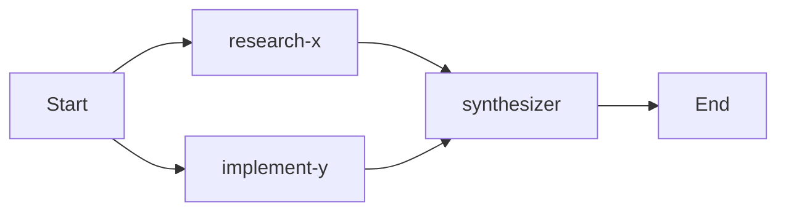

# DAG Execution

Quack converts natural-language requests into a **Directed Acyclic Graph (DAG)** of agent tasks, executes them topologically, and returns vetted answers.

## Planning Phase

The orchestrator delegates DAG authoring to the **planner** in `internal/dag/planner.go`:

- **RawNode** — One DAG node: `ID`, `Agent` (agent bundle name), `Task` (instruction), optional `Rubric`, `DependsOn` (edges), and optional `Checks` (deterministic gate commands)
- **Planner validation** — Checks known agent names, unique IDs, acyclic graph, and check command prefixes match `workspace.check_commands`
- **Planner.CheckCommands()** — Returns configured prefixes; the plan tool description uses this to constrain `Checks` input

The orchestrator uses the `plan-work` skill to produce a plan, which the planner then validates and hardens before execution.

## Native ADK Graph

`internal/dag/nativegraph.go`/`graph.go` builds a **first-class ADK workflow** from the plan:

- **buildPlanGraph** — Wires nodes as edges: leaves fan out from `Start`, single-dependency nodes chain, multi-dependency nodes get a `JoinNode` barrier
- **ADK constraint** — Exactly one terminal node producing output; the planner hardens the synthesizer to depend on all nodes to guarantee this
- **Per-node client identity** — For A2A agents, `ForNode(planID:nodeID)` creates a unique client so concurrent nodes using the same agent don't adopt each other's remote sessions
- **Session sharing** — All nodes share one workflow session (ID = chatID); each node's git/fs tools scope to `chatID`-isolated paths

## Gate Nodes

`buildGateNodes` wraps each plan node in a **gated worker**:

```go
func buildGateNodes(plan Plan, agents map[string]adkagent.Agent, ...) (map[string]workflow.Node, error)
```

Each node:
1. Builds a `vetting.NewWorkerNode(worker)` 
2. Configures `vetting.Config` with:
   - `Checks` — Orchestrator-set deterministic gate commands
   - `Workdir`, `NodeID`, `ChatID` — Workspace scoping
   - `Agent` — For observability attributes
   - `Task` — For delivery check validation
   - `DeriveChecks` — Set true for `code-implementer` to infer from cloned repo
   - `DeliverPromptEvent` — True for A2A workers that need prompt as session event
3. Writes gate results to session state:
   - `quack.gate_failed/{nodeID}`
   - `quack.gate_score/{nodeID}`
   - `quack.gate_passed/{nodeID}`
   - `quack.gate_rounds/{nodeID}`

## Executor (`internal/dag/executor.go`)

The executor translates raw ADK session events into SSE vocabulary:

- **dagStream** — Maps `NodeInfo.Path` + `worker-rN` run IDs to SSE events:
  - `agent_start` — `{"node_id","run_id","agent","stage","round"}`
  - `agent_thinking` — Reasoning text
  - `agent_tool_call` / `agent_tool_result` — Tool activity referencing `call_id`
  - `agent_complete` — Final output
- **Continue-but-warn** — On gate failure, downstream nodes continue but emit warnings with gate result attached
- **Topological ordering** — Ensures dependencies execute before dependents

## Workspace Scoping

Each node's tools operate in an isolated workspace:

- **Chat-scoped** — `chatID` isolates git clones and temp files per request
- **SharedRepoScope** — One clone per plan for repo-touching nodes (`code-implementer`, `code-reviewer`, `code-explorer`)
- **Node-scoped** — Other nodes get `node.ID` as their workspace scope

Git credential injection uses `GIT_ASKPASS` with a symlink to the quack binary (`quack git-askpass` mode) to avoid secrets in `ps` output.

## Example DAG

A "research + implement" request might produce:



- `R1` (researcher) runs first, produces citations
- `I1` (implementer) runs in parallel, clones repo, writes code
- `S` (synthesizer) waits for both, combines findings, commits to memory

## Resilience

- **Restart survival** — Workflow state persists; resumed runs rebuild from checkpoint
- **Parallel execution** — Nodes run concurrently up to provider limits
- **Cancelation** — Cooperative check at stage boundaries (pre-judge round); tool layer refuses canceled node's next tool call
- **HITL pauses** — `ask_user` tool pauses node via `workflow.ResumeOrRequestInput`; user answer routes back to same node

## Known Agents

| Agent | Role | Tools | Memory Role |
|-------|------|-------|-------------|
| `web-researcher` | Search, fetch, summarize | `web_search`, `web_fetch`, `summarize`, `current_date`, `load_memory`, `stage_memory`, `ask_user`, `ask_advisor` | `research` |
| `code-implementer` | Generate, commit, push | Repo tools (fs, git, workspace), `stage_memory` | `coding` |
| `code-reviewer` | Review code, post comments | Read-only fs, `stage_memory` | `coding` |
| `code-explorer` | Read-only exploration | Read-only fs, git clone | `coding` |
| `synthesizer` | Combine findings | `stage_memory` | - |
| `advisor` | General assistant | Various | - |
| `image-reader`, `media-reader` | Analyze attachments | - | - |
