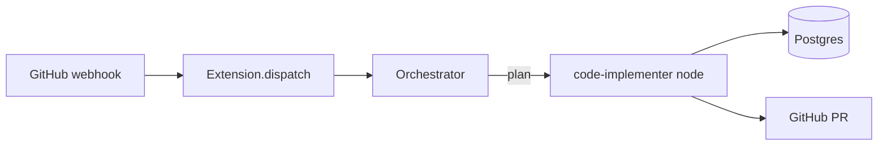
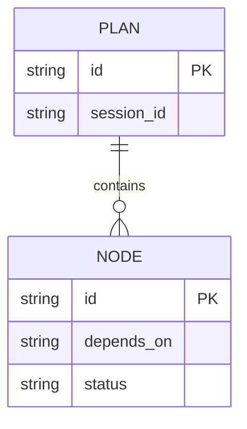
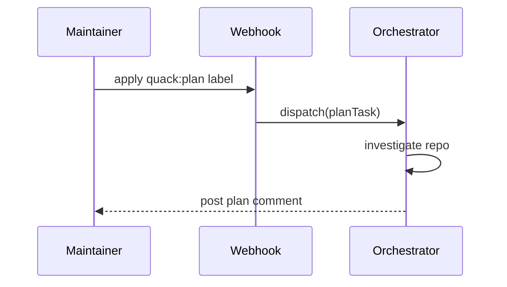

# Present GitHub work: summary-first, deep on demand

A maintainer reads GitHub comments in a feed, at speed. A wall of prose gets
skimmed and the real design decision gets missed. This skill is about
**content depth AND layout** — do not skip the diagrams to save time; a
diagram is often the fastest way to say the thing correctly.

## Structure, in order

1. **Summary** — 2-4 lines: what changed/is proposed and why. No preamble.
2. **Architecture diagram** — `mermaid flowchart` of the components touched
   and how the change flows through them. Skip only if the change is a
   single-file, no-new-component fix.
3. **ERD** — `mermaid erDiagram`, only if a table/column/relationship changes.
4. **Sequence/flow diagram** — `mermaid sequenceDiagram` (or a flowchart) for
   any request lifecycle or control flow the change touches.
5. **API / interface spec** — endpoint or function signatures, request/response
   shapes, new config fields. This is the "output contract" from AGENTS.md's
   spec-driven-development section — reuse it, don't re-derive it.
6. **File-by-file change list** — table: file (with line number or anchor
   when you know it, e.g. `internal/foo/bar.go:42`), the actual change (what
   the code will say or do, not "update the handling of X"), why. If you
   genuinely have not seen the line yet, name the file and say so ("exact
   line TBD — see Honesty ledger below") rather than writing a vague
   location as if it were precise. "Find the right place to add X" is a
   research task, not a change list entry — it belongs in the Honesty ledger
   or an upstream exploration step, never presented here as a planned edit.
7. **Verification** — table or list: for EACH change, the specific test
   file(s) that will be added to or created (named paths, e.g.
   `internal/foo/bar_test.go`) and the EXACT runnable command(s) that prove
   it, derived from the repo's own tooling (`go test ./internal/foo/...`,
   `npm test -- Foo.test.tsx`, a `make` target that already exists) — not the
   generic `go test ./...`/`npm test` unless the whole suite is genuinely the
   right scope. Include at least 2-3 concrete input → expected-output
   acceptance cases alongside the commands. "Add tests" or "verify it works"
   with no named file and no runnable command is not acceptable content for
   this section.
8. **Honesty ledger** — a section titled "What I could not verify /
   assumptions", listing anything the plan asserts without having confirmed
   it firsthand this session: a file/line you're inferring rather than having
   read, a command you believe exists but didn't run, a convention assumed
   from a sibling feature rather than the target code itself. Every plan has
   at least one entry — a plan claiming total certainty about a codebase it
   just started exploring is itself a red flag. Never skip this section.
9. **Deep detail** — anything long (full rationale, alternatives considered,
   a big diff excerpt) goes in a `<details>` fold, never cut.

Skip any section that genuinely doesn't apply (e.g. no ERD for a pure UI
tweak) — an empty section is worse than no section. The Verification and
Honesty ledger sections are the exception: every plan that changes code
carries both, even if the ledger is short. Never lose content to fit this
shape: if it doesn't fit a section above, fold it under `<details>` rather
than dropping it.

## Mermaid: GitHub renders these natively, no image needed

Keep each diagram to what a reviewer needs to orient in 5 seconds — not a
full class dump.

**Architecture** (components + flow):



**ERD** (only for schema changes):



**Sequence** (control flow / request lifecycle):



## Presentation primitives

**Tables over prose** for anything enumerable — file lists, config fields,
before/after comparisons:

| File | Change | Why |
| --- | --- | --- |
| `internal/dag/planner.go:118` | add `MaxDepth int` field to `Plan`, default 6, checked in `Build` before recursing | bound recursive fan-out |
| `agents/code-reviewer/prompt.md` | one-line pointer to the new skill | wire the new skill |

**`<details>` for deep detail** — collapsed by default, one blank line after
`<summary>` (required for the body to render as markdown):

```markdown
<details>
<summary>Alternatives considered</summary>

- Recursive planner call — rejected: no depth bound, risk of runaway fan-out.
- Config-only flag — rejected: doesn't fix the root cause in code.

</details>
```

**GitHub alerts** for things a skim must not miss:

```markdown
> [!WARNING]
> This changes the on-disk session ID format — old sessions will not resume.

> [!NOTE]
> The ERD above only covers the two new columns; existing tables are unchanged.
```

Supported alert types: `NOTE`, `TIP`, `IMPORTANT`, `WARNING`, `CAUTION`. Use
at most one or two per comment — reserve them for things that change what the
reader does next, not routine information.

## Gotchas

- Mermaid syntax errors render as a broken block on GitHub with no fallback —
  keep diagrams small and stick to the syntax shown above if unsure.
- A `<details>` block needs a blank line after `<summary>...</summary>` and
  before the content, or GitHub renders the body as raw text.
- Don't diagram what a table says better (e.g. a flat list of config fields —
  that's a table, not a flowchart).
- This skill governs presentation of the *final* comment/plan text; it does
  not change what work you do or which tools you call.
